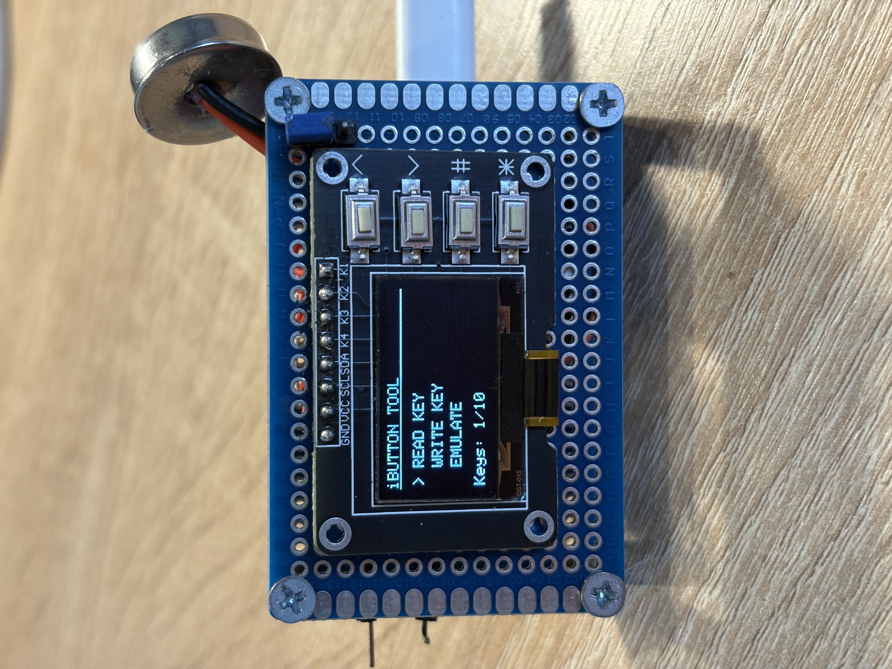
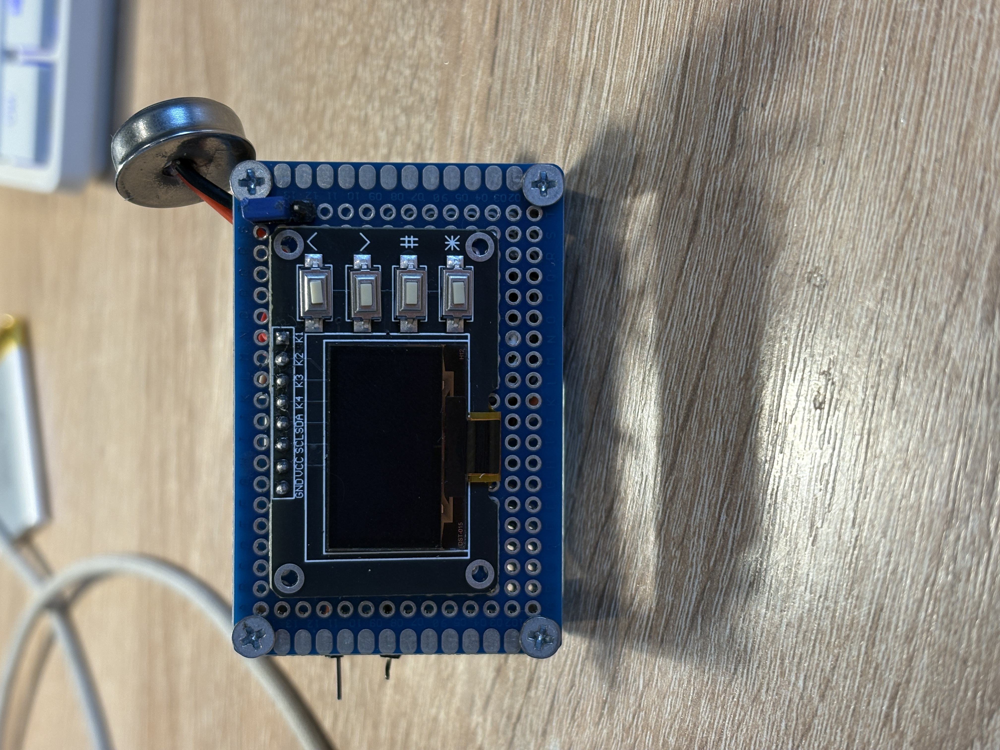
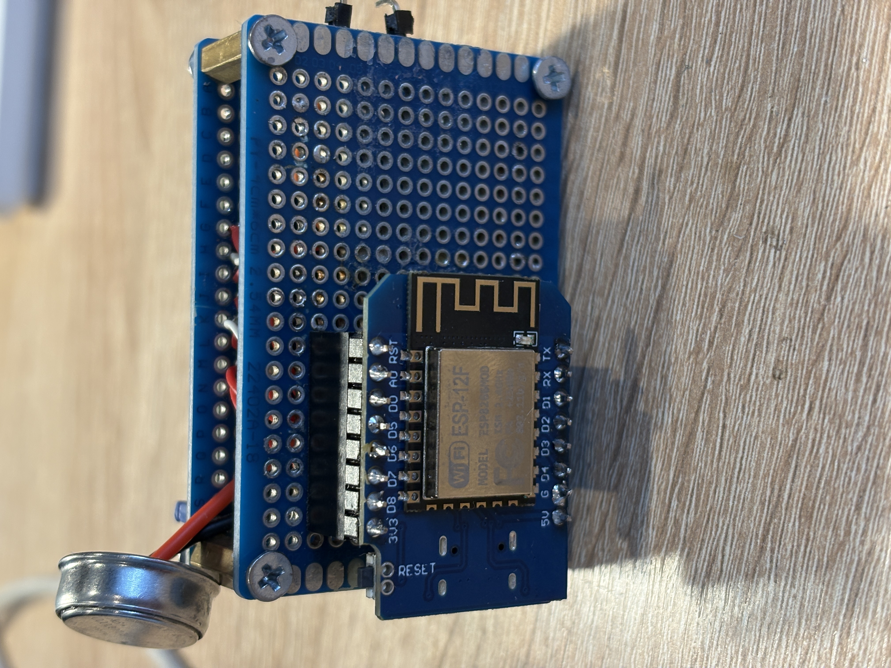

# 🔑 ESPie — iButton Tool


<p align="center">
  Инструмент для работы с iButton ключами (DS1990A / DS2401) на базе ESP8266
</p>

<p align="center">
  
  
  
  
  
</p>

---

## О проекте

**ESPie** — портативное устройство на ESP8266 для чтения, эмуляции и брутфорса iButton ключей серии DS1990A/DS2401. Всё управление — через OLED дисплей и 4 кнопки. Ключи сохраняются в EEPROM (до 10 штук).

> Проект разработан в **Arduino IDE**.

---

## ✨ Функции

| Функция | Статус | Описание |
|---|---|---|
| 📖 **READ KEY** | ✅ Работает | Считать ключ с шины OneWire (GPIO0) |
| 💾 **WRITE KEY** | ❌ Не работает | Записать ключ на чистую метку (в разработке) |
| 📡 **EMULATE** | ✅ Работает | Эмулировать ключ из памяти на GPIO2 (10 сек) |
| 🔓 **BRUTFORCE** | ✅ Работает | Перебор 27 встроенных + сохранённых ключей |
| 🗑️ **DELETE** | ✅ Работает | Удалить ключ из памяти |
| 👁️ **VIEW CODE** | ✅ Работает | Просмотр HEX кода и CRC проверка |

> ⚠️ **Запись ключа (WRITE KEY) на данный момент не работает.** Реализация протокола записи для DS1990A в процессе доработки.

---

## 🔧 Компоненты

- **Микроконтроллер:** ESP8266 (NodeMCU / Wemos D1 Mini)
- **Дисплей:** OLED 128×64, SSD1306, I2C
- **Кнопки:** 4 штуки (UP, DOWN, OK, BACK)
- **Интерфейс iButton:** через GPIO0 (чтение) и GPIO2 (эмуляция)

---

## 📌 Распиновка

| Назначение | GPIO | NodeMCU Pin |
|---|---|---|
| OLED SDA | GPIO4 | D2 |
| OLED SCL | GPIO5 | D1 |
| BTN UP | GPIO13 | D7 |
| BTN DOWN | GPIO12 | D6 |
| BTN OK | GPIO14 | D5 |
| BTN BACK | GPIO16 | D0 |
| OneWire Read/Write | GPIO0 | D3 |
| Emulation TX | GPIO2 | D4 |

---

## 📦 Библиотеки

Установите через **Arduino IDE → Library Manager**:

- [Adafruit SSD1306](https://github.com/adafruit/Adafruit_SSD1306)
- [Adafruit GFX Library](https://github.com/adafruit/Adafruit-GFX-Library)
- [OneWire](https://github.com/PaulStoffregen/OneWire)
- [OneWireHub](https://github.com/orgua/OneWireHub)
- DS2401 (входит в OneWireHub)

---

## 🚀 Установка

1. Клонируйте репозиторий:
```bash
git clone https://github.com/Bit-wizard-esp/espie.git
```

2. Откройте `main.ino` в **Arduino IDE**

3. Установите все библиотеки из списка выше

4. Выберите плату: `Tools → Board → ESP8266 Boards → NodeMCU 1.0` (или вашу)

5. Выберите порт и нажмите **Upload**

---
## 🚀 Установка через flash download tool
1. Скачиваете [flash download tool](https://dl.espressif.com/public/flash_download_tool.zip)

2. Распаковываете zip архив

3. Выбираете плату и порт

4. Загружаете файл из [релизов](https://github.com/Bit-wizard-esp/Espie/releases)

5. Начинаете прошивку

---

## 🗂️ Структура проекта

```
espie/
├── main.ino        # Основной файл, setup/loop, обработка кнопок
├── config.h           # Пины, размеры экрана, константы, структуры
├── globals.h          # Объявления глобальных переменных
├── display.cpp/.h     # Весь код отрисовки меню и экранов
├── onewire_ops.cpp/.h # Операции OneWire: чтение, запись, эмуляция, брутфорс
├── storage.cpp/.h     # Работа с EEPROM: сохранение, загрузка, удаление ключей
└── assets.cpp         # Растровые изображения (логотип, иконка ключа)
```

---

## 💡 Как пользоваться

### Чтение ключа
1. Главное меню → **READ KEY**
2. Приложи iButton к контакту на GPIO0
3. Нажми **OK** чтобы сохранить, или **BACK** чтобы отменить

### Эмуляция
1. Главное меню → **EMULATE**
2. Выбери ключ из памяти кнопками UP/DOWN
3. Нажми **OK** — устройство эмулирует ключ на GPIO2 в течение 10 секунд

### Брутфорс
1. Главное меню → **BRUTFORCE**
2. Устройство покажет количество ключей (27 встроенных + сохранённые)
3. Нажми **OK** — начнётся перебор с интервалом 500 мс
4. **BACK** — остановить

### Просмотр кода ключа
1. Главное меню → **VIEW CODE**
2. Выбери ключ → **OK**
3. Отобразится HEX-код и результат проверки CRC

---

## 🧠 Встроенные ключи для брутфорса

В прошивке предусмотрено **27 встроенных ключей** из базы часто встречающихся значений DS1990A. При брутфорсе к ним автоматически добавляются все сохранённые пользователем ключи.

---

## ⚠️ Известные проблемы

- **WRITE KEY не работает** — запись на перезаписываемые метки iButton пока не реализована корректно. Ведётся разработка.

---

## 📋 TODO

- [ ] Исправить запись ключа на DS1990A
- [ ] Добавить именование ключей через меню
- [ ] Добавить поддержку других типов iButton
- [ ] Увеличить лимит хранимых ключей
- [ ] Добавить экспорт/импорт через Serial

---
## Фото тестовой версии проекта:
  

---
## 📜 Лицензия

MIT License — делай что хочешь, но оставь ссылку на проект.

---


